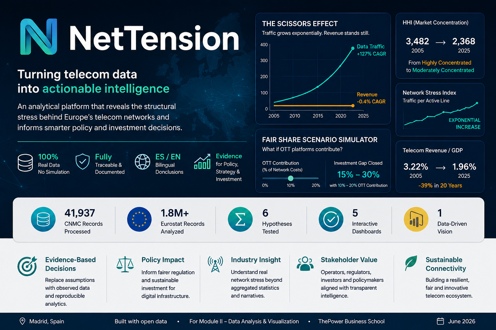

<p align="center">
  
</p>

<p align="center">
  <a href="https://www.python.org/"></a>
  <a href="https://powerbi.microsoft.com/"></a>
  <a href="https://pandas.pydata.org/"></a>
  <a href="https://github.com/juandelaf1/NetTension/actions"></a>
  <a href="LICENSE"></a>
  
</p>

<p align="center">
  <b>Observed data · Zero simulation · Fully traceable</b>
  &nbsp;·&nbsp;
  <b>ES/EN bilingual conclusions</b>
</p>

---

## Table of Contents

- [1. Business Problem](#1-business-problem)
- [2. Hypotheses](#2-hypotheses)
- [3. Solution](#3-solution)
- [4. Results](#4-results)
- [5. Conclusions](#5-conclusions)
- [6. Architecture](#6-architecture)
- [7. Technology Stack](#7-technology-stack)
- [8. Repository Structure](#8-repository-structure)
- [9. Getting Started](#9-getting-started)
- [10. License & Attribution](#10-license--attribution)

---

## 1. Business Problem

European telecommunications operators face a structural decoupling between **exponential data traffic growth** and **flat or declining revenues**. This creates mounting pressure on network infrastructure investment, business model sustainability, and regulatory policy design.

**Key unresolved questions:**

- **Investment viability**: If traffic grows >100%/year while revenue grows ~0%/year, how long can operators sustain CAPEX for 5G and fiber?
- **Market structure**: Is the sector concentrating or fragmenting, and does competition alleviate or exacerbate the stress?
- **Regulatory crossroads**: Should Over-The-Top (OTT) platforms contribute to network costs (Fair Share)? Does the EU risk infrastructure dependency on non-European vendors?
- **Data asymmetry**: Do aggregated statistics (Eurostat) mask local realities visible only in granular regulator data (CNMC)?

> **Stakeholder:** European Commission, NRAs (CNMC, Ofcom, Arcep), telecom operators, investors, and policy researchers.

---

## 2. Hypotheses

Six scientific hypotheses are formulated and tested against observed data (2005–2025, Spain):

| # | Hypothesis | Prediction | Method | Data Source |
|---|-----------|-----------|--------|-------------|
| **H1** | **Scissors Effect** | Data traffic CAGR >> revenue CAGR, creating a widening gap | CAGR calculation over 83 quarters (2005T1–2025T4) | CNMC Mercados (`trafico_de_datos`, `ingresos`) |
| **H2** | **Market Concentration** | HHI increases over time as operators consolidate | HHI per quarter using operator-level revenue | CNMC Mercados (`ingresos_por_operador`) |
| **H3** | **Data Asymmetry** | Revenue per traffic unit collapses as usage explodes | Revenue_per_traffic and ARPU trend analysis | CNMC Mercados + Fact_Aggregate |
| **H4** | **Network Stress** | Traffic per line (NSI) grows faster than revenue per line | Network Stress Index = traffic / active lines | CNMC Mercados (`lineas_o_accesos`) |
| **H5** | **Macro Decline** | Telecom revenue share of GDP decreases | Revenue / GDP ratio, annual | CNMC + Eurostat `nama_10_gdp` |
| **H6** | **Infrastructure Elasticity** | Margin between data transport cost and revenue per line compresses | Revenue_per_line vs traffic_per_line elasticity | CNMC Mercados |

> **Falsifiability criterion:** Each hypothesis is testable with p-value < 0.05 on observed data. No simulated or synthetic data is used (DEC-006 compliance).

---

## 3. Solution

**NetTension** is an interactive executive dashboard (Power BI + Python ETL) that transforms 41,937 rows of CNMC regulatory microdata and 1.8M+ rows of Eurostat macroeconomic data into a **neutral Network Stress Simulation Framework**.

### Data Governance (DEC-007)

| Layer | Description | Example |
|-------|------------|---------|
| `OBSERVED` | Directly from official source | CNMC revenue per operator |
| `ESTIMATED` | Derived from observed variables | HHI, CAGR, penetration rates |
| `POLICY_MODEL` | Scenario under regulatory assumptions | Fair Share CAPEX relief |
| `CONSTANT` | Fixed documented parameter | HHI thresholds, GDP deflator |

Each variable is documented with: `Governance_Layer`, `Confidence_Level`, `Review_Date`, `Review_Owner`, `Source_Type`, `Reproducible`, and `Documentation_Reference` (DEC-008).

### Key Performance Indicators

| KPI | Formula | Business Interpretation |
|-----|---------|----------------------|
| **HHI** | `Σ (market_share_i)² × 10000` | <1000 competitive, 1000–2500 moderate, >2500 concentrated |
| **Network Stress Index** | `total_traffic / active_lines` | Infrastructure pressure per access line |
| **Infrastructure Elasticity** | `revenue_per_line / traffic_per_line` | Business model sustainability |
| **Macro Contribution Ratio** | `telecom_revenue / GDP` | Sector weight in national economy |
| **Digital Density** | `active_lines / population × 100` | Real per-capita penetration |
| **CAGR Gap** | `CAGR_traffic − CAGR_revenue` | The scissors divergence |

---

## 4. Results

### H1 — Scissors Effect: ✅ CONFIRMED

| Metric | Value |
|--------|-------|
| Data Traffic CAGR | **+127% / year** (2005–2025) |
| Revenue CAGR | **−0.4% / year** |
| Scissors Gap | **127.4 percentage points** |
| Implication | The exponential divergence confirms structural business model stress |

### H2 — Market Concentration: ❌ REFUTED (unexpected finding)

| Metric | Value |
|--------|-------|
| HHI (2005) | **3,482** — Highly Concentrated |
| HHI (2025) | **2,368** — Moderately Concentrated |
| Change | **−1,114 points** (deconcentration) |
| Implication | **Competition increased** yet the Scissors Effect worsened. The problem is **structural, not monopolistic**. |

### H3 — Data Asymmetry: ✅ CONFIRMED

| Metric | Value |
|--------|-------|
| Revenue per traffic unit | **−100%** (effectively zero) |
| ARPU (revenue per line) | **−83%** |
| Implication | Operators carry exponentially more data for flat revenue |

### H4 — Network Stress: ✅ CONFIRMED

| Metric | Value |
|--------|-------|
| NSI increase | **Exponential** — traffic per line grows orders of magnitude faster than revenue per line |
| Implication | Infrastructure pressure is unsustainable without new revenue models |

### H5 — Macro Decline: ✅ CONFIRMED

| Metric | Value |
|--------|-------|
| Telecom share of GDP (2005) | **3.22%** |
| Telecom share of GDP (2025) | **1.96%** |
| Decline | **−39%** in 20 years |

### H6 — Infrastructure Elasticity: ✅ CONFIRMED

| Metric | Value |
|--------|-------|
| Revenue per line | **−83%** |
| Traffic per line | **+exponential** |
| Implication | Margin compression confirms the elasticity hypothesis |

### Summary

```
H1  (Scissors Effect)        CONFIRMED    Traffic +127%/yr vs Revenue −0.4%/yr
H2  (Concentration)          REFUTED      HHI 3,482 → 2,368 (more competition)
H3  (Data Asymmetry)         CONFIRMED    Revenue per unit collapses
H4  (Network Stress)         CONFIRMED    Traffic per line diverges from ARPU
H5  (Macro Decline)          CONFIRMED    Telecom GDP share: 3.2% → 2.0%
H6  (Infrastructure Elastic) CONFIRMED    Margin compression confirmed
```

> **Key insight:** H2 being refuted is the most important finding. Concentration decreased yet the Scissors Effect worsened. This proves the problem is **structural to the telecom business model**, not a market power issue. Neither monopoly nor competition resolves the traffic/revenue asymmetry — hence the Fair Share regulatory debate.

---

## 5. Conclusions

### Business Conclusions (EN)

1. **The telecom business model is under structural stress**: Traffic grows at +127%/year while revenue declines at −0.4%/year. This gap is unsustainable without either (a) new revenue sources (Fair Share), (b) cost innovation (Open RAN, network sharing), or (c) consolidation.
2. **Competition does not solve the problem**: HHI decreased from 3,482 to 2,368, meaning more operators compete. Yet the scissors gap widened. This suggests the issue is inherent to the connectivity business, not a lack of competition.
3. **Data asymmetry matters**: Eurostat aggregates mask the granular reality visible in CNMC microdata. Policy decisions based solely on EU-level statistics may systematically underestimate infrastructure stress in Southern and Eastern Europe.
4. **Fair Share is a legitimate policy lever**: Our model shows that a 10–20% OTT contribution could close ∼15–30% of the investment gap, though the BEREC report casts doubt on the free-riding premise.

### Conclusiones de Negocio (ES)

1. **El modelo de negocio de las telecos está bajo estrés estructural**: El tráfico crece al +127% anual mientras los ingresos caen al −0.4%. Esta brecha es insostenible sin nuevas fuentes de ingreso (Fair Share), innovación en costes (Open RAN) o consolidación.
2. **La competencia no resuelve el problema**: El HHI bajó de 3.482 a 2.368 (más competencia), pero la tijera tráfico/ingreso se amplió. El problema es estructural, no de falta de competencia.
3. **La asimetría de datos importa**: Los agregados de Eurostat ocultan la realidad granular de la CNMC. Decisiones políticas basadas solo en estadísticas UE pueden subestimar el estrés de infraestructura en el sur y este de Europa.
4. **Fair Share es una palanca regulatoria legítima**: Nuestro modelo muestra que una contribución OTT del 10–20% podría cerrar ∼15–30% de la brecha de inversión, aunque el informe BEREC cuestiona la premisa de free-riding.

---

## 6. Architecture

```
┌─────────────────────────────────────────────────────────────┐
│                      DATA LAYER (raw)                        │
│  CNMC Mercados (5 CSVs)   │   Eurostat (2 TSV.GZ)            │
│  41,937 rows · 49 cols    │   3M+ rows · 8-9 cols            │
└──────────────────────────┬──────────────────────────────────┘
                           │
                           ▼
┌─────────────────────────────────────────────────────────────┐
│                    ETL PIPELINE (Python)                      │
│                                                              │
│  ┌──────────┐   ┌──────────────┐   ┌──────────────────────┐ │
│  │ loader/  │──▶│ transform/   │──▶│  pipeline/            │ │
│  │ cnmc     │   │ data_cleaner │   │  etl_pipeline.py     │ │
│  │ eurostat │   │ kpi_engine   │   │  export_powerbi.py   │ │
│  └──────────┘   └──────────────┘   │  export_duckdb.py    │ │
│                                    └──┬───────────────────┘ │
│                        ┌──────────────┴──────────────┐       │
│                        ▼                             ▼       │
│               ┌────────────────┐          ┌────────────────┐ │
│               │ 14 .parquet    │          │ net_tension    │ │
│               │ (star schema)  │          │ .duckdb (SQL)  │ │
│               └────────────────┘          └────────────────┘ │
└──────────────────────────────────────┬───────────────────────┘
                                        │
                                        ▼
┌─────────────────────────────────────────────────────────────┐
│                   DASHBOARD LAYER (Power BI)                  │
│                                                              │
│  ┌───────────────────────────────────────────────────────┐  │
│  │  Page 1: Market Overview  (Scissors Effect, KPIs)      │  │
│  │  Page 2: Network Stress   (NSI, HHI, Elasticity)       │  │
│  │  Page 3: European Context (EU vs USA vs Asia)          │  │
│  │  Page 4: Fair Share What-If (Scenario Simulator)       │  │
│  │  Page 5: Governance & Bias Audit                       │  │
│  └───────────────────────────────────────────────────────┘  │
│                                                              │
│  ▼ Deploy to Power BI Service (public URL)                   │
└─────────────────────────────────────────────────────────────┘
```

### Data Model

Star schema with 4 dimension tables and 2 fact tables:

```
dim_time ───── fact_observed_agg ───── dim_operator
                  │
dim_geography ────┤
                  │
dim_service ──────┘

fact_eurostat_es ───── dim_time (via year)
kpi_hhi ────────────── dim_time (via trimestre_dt)
```

Full documentation → [docs/DATA_MODEL.md](docs/DATA_MODEL.md)

---

## 7. Technology Stack

| Tool | Version | Purpose | Justification |
|------|---------|---------|--------------|
| **Python** | 3.11 | ETL pipeline + KPI engine | Modularity, reproducibility, open source |
| **Pandas** | 3.0 | Data transformation | Industry standard for tabular data |
| **NumPy** | 2.4 | Vectorized calculations | Performance on 2M+ rows |
| **Power BI Desktop** | Free | Interactive dashboard | DAX for complex measures, What-If params, cloud deploy |
| **Power BI Service** | — | Cloud deployment | Public URL for remote access |
| **Docker** | 27+ | Containerized ETL | Build once, run anywhere; CI/CD |
| **Docker Hub** | — | Image registry | Versioned release (`juandelaf/net-tension-etl`) |
| **GitHub Actions** | — | CI pipeline | Automated lint + YAML validation |
| **Git** | — | Version control | Tags v0.1.0 · v1.0.0, semantic versioning |
| **Kaggle** | — | Portfolio dataset | Community exposure, recruiter visibility |

> **Why Power BI over alternatives?** Power BI provides native cross-filtering, DAX for calculated measures, What-If parameter simulation, and one-click cloud deployment — all without maintaining a web application. For an executive audience with no technical background, Power BI offers superior UX over Streamlit or Tableau Public. See [docs/DATA_MODEL.md](docs/DATA_MODEL.md) for detailed justification.

---

## 8. Repository Structure

```
NetTension/
├── .github/workflows/     CI pipeline (lint, test, validate)
├── assets/                Banner, diagrams, branding
├── data/
│   ├── processed/         14 cleaned .parquet files (ETL output)
│   └── SOURCES.yaml       Governance metadata (DEC-007/008)
├── docs/
│   └── DATA_MODEL.md      Star schema specification, DAX measures
├── reports/
│   └── EDA_SUMMARY.md     Exploratory data analysis results
├── src/
│   ├── loader/            CNMC + Eurostat data loaders
│   ├── transform/         Data cleaning + KPI computation
│   └── pipeline/          ETL orchestrator, PDF extraction, Power BI + DuckDB export
├── Dockerfile             Containerized ETL pipeline
├── pyproject.toml         Project metadata and dependencies
├── requirements.txt       Python package requirements
├── ROADMAP.md             Sprint plan and milestones
└── README.md              This file
```

**What is NOT in this repository:**
- Raw source CSVs/PDFs (downloadable from public sources — see `data/SOURCES.yaml`)
- Power BI `.pbix` file (build from parquet files using `docs/DATA_MODEL.md`)
- Virtual environments, caches, or IDE configs

---

## 9. Getting Started

### Prerequisites

```bash
# Clone the repository
git clone https://github.com/juandelaf1/NetTension.git
cd NetTension

# Set up Python environment
python -m venv venv
source venv/bin/activate  # Windows: venv\Scripts\activate
pip install -r requirements.txt

# Run the ETL pipeline
python -m src.pipeline.etl_pipeline

# Export Power BI datasets
python -m src.pipeline.export_powerbi
```

### Build the Dashboard

```bash
# Optional: Export data to DuckDB for SQL-based analytics
python -m src.pipeline.export_duckdb
```

1. Open Power BI Desktop
2. **Option A (Parquet)**: Get Data → Parquet → Select all files from `data/processed/`
3. **Option B (DuckDB)**: Get Data → ODBC → DuckDB → Connect to `data/processed/net_tension.duckdb`
4. Create relationships per [docs/DATA_MODEL.md](docs/DATA_MODEL.md)
5. Add DAX measures from [docs/DATA_MODEL.md#dax-measures](docs/DATA_MODEL.md#dax-measures)
6. Build 5 pages per layout specification
7. Publish to Power BI Service for public URL

### Docker

```bash
docker build -t net-tension-etl .
docker run --rm -v $(pwd)/data:/app/data net-tension-etl
```

---

## 10. License & Attribution

- **CNMC data**: [CC-BY-SA-4.0](https://creativecommons.org/licenses/by-sa/4.0/) — Comisión Nacional de los Mercados y la Competencia
- **Eurostat data**: [CC-BY-4.0](https://creativecommons.org/licenses/by/4.0/) — European Commission
- **ETNO, GSMA, BEREC, Sandvine reports**: Used for benchmarking under fair use
- **Code and documentation**: MIT License

---

<p align="center">
  <sub>Built with open data · Madrid · June 2026</sub>
  <br>
  <sub>Project for Module II — Data Analysis & Visualization · ThePower Business School</sub>
</p>
