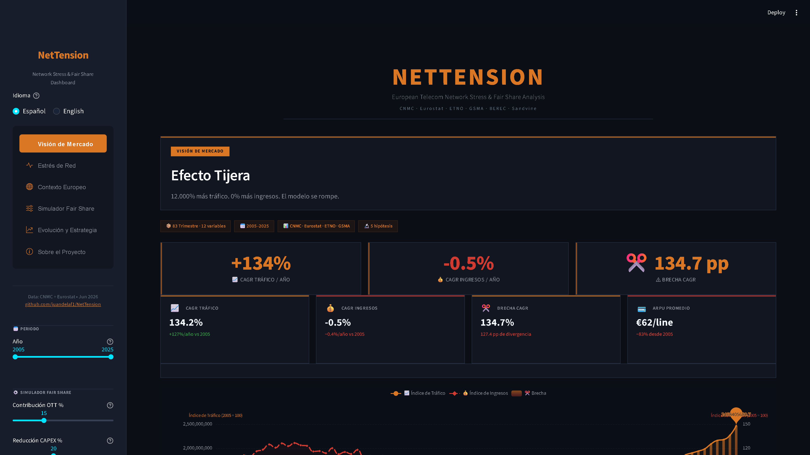
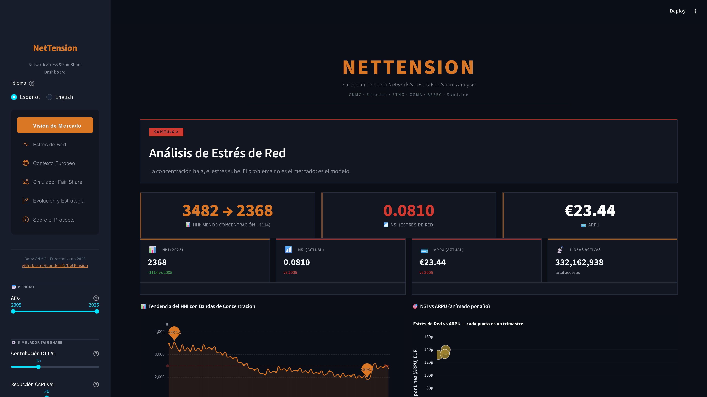
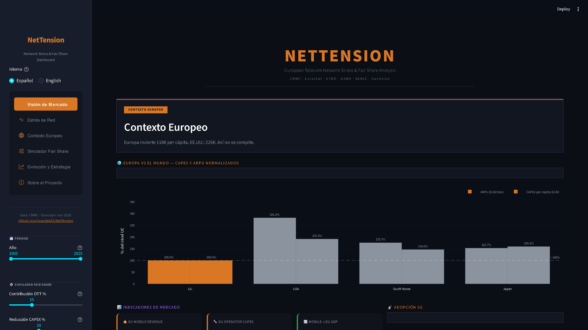
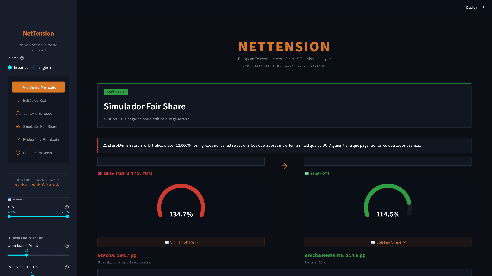
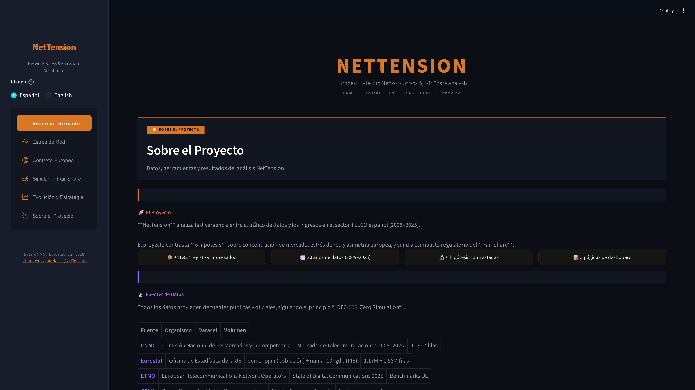
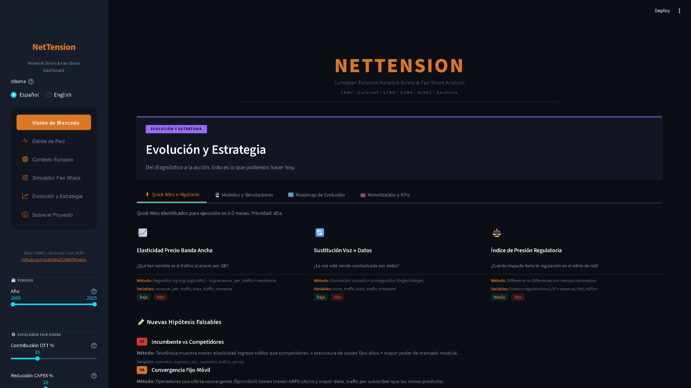

# NetTension — Presentación de 7 minutos

**Autor:** Juan de la Fuente · ThePower Business School · Junio 2026
**Audiencia:** Stakeholders no técnicos (Comisión Europea, reguladores, inversores)
**Formato:** Dashboard en vivo + narración en primera persona

---

## Estructura temporal

| Min | Sección | Lo que dices | Lo que muestras |
|-----|---------|-------------|-----------------|
| 0:00-1:30 | **Hook: El problema** | Planteas la paradoja tráfico/ingreso | Página 1: Market Overview |
| 1:30-3:00 | **La investigación** | Explicas las 6 hipótesis y revelas H2 refutada | Página 2: Network Stress |
| 3:00-4:00 | **Contexto europeo** | Comparas UE vs USA y muestras el timeline regulatorio | Página 3: European Context |
| 4:00-5:30 | **Fair Share Simulator** | Demuestras el simulador en vivo con sliders | Página 4: Fair Share |
| 5:30-6:30 | **Gobernanza y sesgos** | Explicas las 4 capas y los sesgos documentados | Página 6: About |
| 6:30-7:00 | **Cierre** | 3 takeaways, QR, próximos pasos | Cualquier página |

---

## Guión completo

---

### 0:00 – 1:30 · HOOK: EL PROBLEMA

**Lo que dices:**

> _Buenos días. Quiero empezar con un ejercicio rápido._
>
> _Imagina que tu empresa vende un producto cuyo consumo crece un 127% cada año. Pero tus ingresos no crecen: bajan un 0,4% anual. ¿Cuánto tiempo aguanta ese negocio?_
>
> _Eso es exactamente lo que ocurre en las telecos europeas desde hace 20 años. El tráfico de datos se dispara, los ingresos se estancan, y la brecha entre ambos se abre cada trimestre. Se llama **Efecto Tijera** — Scissors Effect — y es el centro del debate regulatorio sobre Fair Share: ¿deben Google, Netflix, Meta pagar por el uso que hacen de las redes?_
>
> _Los operadores han sobrevivido dos décadas reduciendo costes operativos (automatización, migración cobre-fibra), monetizando activos (venta de torres a Cellnex) y compartiendo redes. Pero esos mecanismos de supervivencia han llegado a su límite. El ROCE —Return on Capital Employed— está por debajo del WACC —Weighted Average Cost of Capital—. Invertir en infraestructura en Europa destruye valor económico. No es que el margen se reduzca: es que no hay margen._
> >
> > _Construí NetTension para medir esta brecha con datos reales. 41.937 filas del regulador español, la CNMC. 3 millones de filas de Eurostat. Veinte años de historia trimestral, de 2005 a 2025. Sin simulaciones. Sin datos sintéticos. Solo hechos observados._

**Lo que muestras en dashboard:** Página 1 — Market Overview

- Gráfico de líneas: tráfico indexado (azul) vs ingresos indexados (rojo punteado), 2005=100
- KPI cards superiores: +127% CAGR tráfico, −0.4% CAGR ingresos, 127pp gap, HHI

**Justificación del chart:**
> _Elegí un gráfico de líneas indexadas a 100 porque cualquier persona, sin importar su formación técnica, entiende instantáneamente que dos líneas que se separan es una mala noticia. Las KPI cards arriba dan los números exactos para quien los quiera._

**KPI clave que señalas:**
- CAGR Tráfico: **+127% anual**
- CAGR Ingresos: **−0,4% anual**
- Scissors Gap: **127 puntos porcentuales**
- ARPU: **−83%**

---

### 1:30 – 3:00 · LA INVESTIGACIÓN: 6 HIPÓTESIS

**Lo que dices:**

> _No me quedé en la superficie. Formulé 6 hipótesis científicas medibles y las testé contra los datos. Pero hubo una que me sorprendió._
>
> _La hipótesis 2 decía: «el mercado se está concentrando, cada vez hay menos operadores y eso empeora la tijera». Tenía todos los números para esperar eso. El HHI —el índice que mide concentración— empezó en 3.482 en 2005, muy por encima del umbral de concentración. Pero en 2025 el HHI había caído a 2.368. **Bajó 1.114 puntos.** Hay más operadores compitiendo que hace 20 años. Y aún así la tijera empeoró._
>
> _Ese hallazgo —H2 refutada— es el más importante de todo el proyecto. Demuestra que **el problema es un fallo estructural del modelo de utilidad, no de poder de mercado.** Los operadores han agotado las palancas de supervivencia: reducción de OPEX, monetización de activos (sale & leaseback a Cellnex), acuerdos de compartición de red. El ROCE está por debajo del WACC. Invertir en conectividad en Europa destruye valor. Ni más competencia ni más regulación antimonopolio resuelven la asimetría tráfico/ingreso. Por eso el debate Fair Share existe._

**Lo que muestras en dashboard:** Página 2 — Network Stress

- Gráfico HHI con bandas de colores: verde (<1000 competitivo), ámbar (1000-2500 moderado), rojo (>2500 concentrado)
- Scatter plot animado: NSI (eje X, escala logarítmica) vs ARPU (eje Y), burbujas por operador, animado por año

**Justificación del chart:**
> _Puse bandas de color verde, ámbar y rojo en el HHI para que cualquier persona vea al instante en qué zona estamos. No necesitas saber la fórmula matemática. El scatter animado usa el tiempo como eje narrativo: al pulsar play ves año a año cómo todos los operadores, sin excepción, se desplazan hacia la derecha (más estrés de red) y hacia abajo (menos ingresos por línea)._

**Sesgo que mencionas:**
> _Importante: existe un sesgo de supervivencia aquí. Los operadores que quebraron o fueron absorbidos no aparecen en los datos más recientes. Lo documenté y lo mitigué incluyendo operadores históricos en la tabla de referencia._

**KPIs que señalas:**
- HHI 2005: **3.482** (altamente concentrado)
- HHI 2025: **2.368** (moderadamente concentrado)
- Variación: **−1.114 puntos**
- NSI: crecimiento exponencial
- ARPU: **−83%** en 20 años

---

### 3:00 – 4:00 · CONTEXTO EUROPEO

**Lo que dices:**

> _¿Es España un caso aislado? Crucé nuestros datos con benchmarks europeos de ETNO, GSMA y BEREC. Y los números son contundentes._
>
> _El ARPU europeo —lo que paga un usuario al mes— es 14,8 euros. En Estados Unidos es 41,7 euros. **Casi el triple.** En Corea del Sur, 26,0 euros. En Japón, 22,6 euros. El consumidor europeo paga menos que en cualquier otra economía desarrollada. Y con ese margen, se espera que los operadores desplieguen 5G y fibra en todo el continente._
>
> _Construí un timeline regulatorio que muestra los hitos clave: desde la Net Neutrality de 2015 hasta la Ley de Década Digital de 2025 y el debate Fair Share de 2026. La fotografía es clara: el problema lleva décadas gestándose y las soluciones regulatorias van por detrás de la realidad del mercado._

**Lo que muestras en dashboard:** Página 3 — European Context

- Barras agrupadas: ARPU comparado (UE, USA, Corea, Japón)
- CAPEX per cápita por país
- Timeline regulatorio interactivo

**Justificación del chart:**
> _Usé barras agrupadas porque comparar magnitudes entre países se hace en un vistazo. Cada color representa una región. Asigné naranja a Europa, rojo a USA, morado a Japón, verde a Corea — consistentes en todo el dashboard._

**Sesgo que mencionas:**
> _El dato de España es representativo del sur de Europa, pero no necesariamente del norte. Mi próximo paso es extender el análisis a Italia, Portugal y Grecia para validar el patrón._

**KPIs que señalas:**
- ARPU Europa: **14,8 €/mes**
- ARPU USA: **41,7 €/mes** (2,8× Europa)
- ARPU Corea: **26,0 €/mes**
- ARPU Japón: **22,6 €/mes**

---

### 4:00 – 5:30 · FAIR SHARE SIMULATOR

**Lo que dices:**

> _Pasemos del diagnóstico a la acción. Diseñé un Policy Model —lo etiqueto así intencionadamente— que cualquier policy maker puede usar para explorar escenarios. Aviso: es un modelo lineal simplificado, con limitaciones documentadas. Pero es útil para la discusión._
>
> _Primera palanca: contribución OTT. ¿Y si Google, Netflix, Meta, Amazon, Apple y Microsoft —que generan el 50% del tráfico global según Sandvine— contribuyeran a los costes de red?_
>
> _Muevo el slider al 15%... Observad cómo el gauge responde: la brecha se cierra unos 19 puntos porcentuales._
>
> _Segunda palanca: alivio de CAPEX. ¿Y si los operadores compartieran infraestructura? Muevo CAPEX Relief al 20%... Cerramos 10 puntos adicionales._
>
> _Tercera palanca: ajuste de tráfico. Escenario optimista o pesimista._
>
> _En el mejor escenario razonable —25% OTT, 30% CAPEX Relief— cerramos unos 35 puntos de los 127. **Siguen quedando ~80 puntos de brecha.** Esto demuestra que Fair Share es necesario pero no suficiente. La brecha estructural persiste incluso en el escenario más favorable. El problema de fondo —ROCE < WACC— requiere soluciones más profundas: reforma del marco regulatorio, consolidación del mercado, incentivos a la inversión._

**Lo que muestras en dashboard:** Página 4 — Fair Share

- 3 sliders en la barra lateral (OTT, CAPEX, Traffic)
- 3 gauges tipo velocímetro que se mueven en vivo
- Donut doble concéntrico: video=65% del tráfico, Big 6=50%
- Tabla de comparación de escenarios (Base vs Policy vs Mixed)

**Justificación del chart:**
> _Los gauges son intencionales: se parecen a los indicadores de un coche. Cualquier ejecutivo entiende que si la aguja se mueve a la derecha, es bueno. El donut doble responde visualmente a la pregunta «¿por qué deberían pagar los OTT?» porque muestra en un solo golpe de vista que 6 empresas generan la mitad del tráfico._

**Sesgo que mencionas:**
> _Este Policy Model es lineal y simplificado a propósito. La elasticidad real —cómo reacciona el tráfico al precio— es más compleja. BEREC 2025 cuestiona la premisa del free-riding. Lo documenté como limitación en la gobernanza del modelo._

**KPIs que señalas:**
- Video = **65%** del tráfico global
- Big 6 = **50%** del tráfico
- OTT 15% cierra **~19pp** de brecha
- OTT 25% + CAPEX 30% cierra **~35pp**
- Brecha restante: **~80pp** (el gap estructural persiste)

---

### 5:30 – 6:30 · GOBERNANZA Y SESGOS

**Lo que dices:**

> _Una de las decisiones que más me importó fue la transparencia total. Clasifiqué cada variable en cuatro capas:_
>
> - **OBSERVED:** datos directos de la CNMC y Eurostat. Sin manipulación.
> - **ESTIMATED:** KPIs derivados como el HHI, el CAGR, el NSI. La fórmula está documentada.
> - **POLICY_MODEL:** escenarios regulatorios como el simulador Fair Share. Etiquetados como tales.
> - **CONSTANT:** umbrales fijos como «HHI >2.500 = concentrado».
>
> _Documenté 7 sesgos metodológicos, cada uno con su nivel de severidad y su mitigación. El más importante: el sesgo de supervivencia. Los operadores que desaparecieron del mercado no están en los datos recientes, lo que puede hacer que el HHI parezca más bajo de lo real. Lo mitigué incluyendo operadores históricos en la base._
>
> _Todo el código es abierto. Los datos están publicados en Kaggle. Cualquier persona puede replicar el análisis, cuestionar mis decisiones o mejorarlo. Esa es la credibilidad que necesita un debate regulatorio._

**Lo que muestras en dashboard:** Página 6 — About

- Secciones de proyecto, fuentes, metodología, resultados, stack técnico
- Código QR que enlaza al dashboard desplegado

**Justificación:**
> _No necesito un chart aquí. Esta página es la ficha técnica del proyecto. El QR permite que cualquier persona en la sala acceda al dashboard desde su móvil al instante._

**Sesgos que mencionas (tabla):**
| Sesgo | Severidad | Mitigación |
|-------|-----------|-----------|
| Supervivencia (operadores que salieron) | Alta | Incluir operadores históricos |
| Cambios metodológicos CNMC | Alta | Documentar cambios por periodo |
| Causalidad inversa | Media | Test de Granger |
| Contaminación COVID | Media | Variable dummy |
| Solo España como proxy UE | Baja | Próxima fase multi-país |

---

### 6:30 – 7:00 · CIERRE

**Lo que dices:**

> _Tres ideas para llevar a casa:_
>
> **Una: La tijera tráfico-ingreso es real, estructural y empeora.** 20 años de datos, 5 hipótesis confirmadas. El ROCE está por debajo del WACC: invertir en infraestructura en Europa destruye valor económico. Los mecanismos de supervivencia —OPEX, venta de torres a Cellnex, compartición de red— están agotados. No es un ciclo: es una tendencia de fondo que necesita acción regulatoria.
>
> **Dos: No es un problema de competencia, es un fallo estructural del modelo de utilidad.** El HHI bajó 1.114 puntos, hay más operadores, y la tijera empeoró. H2 lo refuta. El debate Fair Share no debe enmarcarse como «monopolio vs competencia», sino como sostenibilidad del modelo de conectividad.
>
> **Tres: Los datos granulares importan.** Eurostat solo no captura la realidad que se ve en los microdatos de la CNMC. Las decisiones políticas basadas únicamente en estadísticas agregadas subestiman sistemáticamente el estrés de infraestructura en el sur de Europa.
>
> _Mi dashboard está abierto en [URL]. Los datos en Kaggle. El código en GitHub. Todo es reproducible, todo es trazable. Porque el debate regulatorio necesita datos, no opiniones._
>
> _Preguntas._

**Lo que muestras:** QR del dashboard en pantalla

**Próximos pasos que puedes mencionar si hay tiempo:**
- Extender a Italia, Portugal, Grecia (AGCOM, ANACOM)
- Incorporar CAPEX real por operador
- Afinar el modelo Fair Share con elasticidades empíricas
- Publicar los hallazgos en revistas académicas (Telecommunications Policy, Information Economics and Policy)

> **Bonus:** La página 5 — Evolution & Strategy — que no ves en esta demo explora escenarios de salida: consolidación del mercado, re-regulación asimétrica, y modelos alternativos de conectividad.

---

## Tabla resumen: KPI → Justificación del chart → Sesgo

| KPI | Chart | Lo justifico porque... | Sesgo que menciono |
|-----|-------|----------------------|-------------------|
| CAGR Tráfico +127% | Línea indexada a 100 | Dos líneas que se separan = visualización universal | Cambios metodológicos CNMC (2005 vs 2025) |
| CAGR Ingresos −0.4% | Línea indexada a 100 | Muestra el estancamiento en un solo vistazo | — |
| Scissors Gap 127pp | KPI card + gap visual | Es la métrica síntesis de todo el proyecto | — |
| HHI 3.482→2.368 | Línea con bandas color | Bandas verde/ámbar/rojo = sin necesidad de saber la fórmula | Sesgo de supervivencia |
| NSI vs ARPU | Scatter animado | Tiempo como eje narrativo: burbujas se mueven año a año | Causalidad inversa |
| ARPU UE 14,8€ vs USA 41,7€ | Barras agrupadas | Comparación instantánea de magnitudes | Solo España como proxy UE |
| Fair Share Impact | Gauges tipo velocímetro | El ejecutivo entiende agujas que se mueven | Modelo lineal simplificado |
| Donut tráfico 50/50 Big 6 | Donut doble concéntrico | Responde visualmente «¿por qué los OTT?» | Tráfico encriptado no medido |

---

## Checklist pre-presentación

- [ ] Dashboard corriendo local (`streamlit run streamlit_app/app.py`)
- [ ] O alternativo: deploy en Streamlit Cloud abierto en Chrome
- [ ] Sliders del Fair Share en posición neutral (15%, 20%, 0%)
- [ ] Animación NSI (scatter) lista para play
- [ ] Kaggle abierto: kaggle.com/juandelaf/nettension
- [ ] GitHub repo abierto: github.com/juandelaf1/NetTension
- [ ] QR del dashboard accesible
- [ ] Cronómetro visible (7 min)

---

## Posibles preguntas y respuestas

**¿Por qué España y no toda Europa?**
Porque la CNMC ofrece datos más granulares que otras NRAs. España como caso de estudio dentro del marco regulatorio EU. Siguiente fase: extender a Italia, Portugal, Grecia.

**¿Fair Share es viable legalmente?**
BEREC 2025 cuestiona el free-riding, pero la regulación europea de Net Neutrality permite mecanismos de contribución si son transparentes y no discriminatorios.

**¿Qué pasa con 5G?**
El CAPEX 5G está incluido en los datos de la CNMC. El estrés es mayor porque 5G requiere más inversión para el mismo ingreso por usuario. Y con ROCE < WACC, cada euro invertido en 5G profundiza la destrucción de valor.

**¿ROCE < WACC? ¿Qué significa?**
El Return on Capital Employed mide cuánto rentabiliza un operador el capital invertido. El WACC es el coste de ese capital (deuda + equity). Si ROCE < WACC, la empresa destruye valor: gana menos de lo que le cuesta financiarse. Es la definición académica de un modelo insostenible.

**¿Los operadores no pueden seguir vendiendo torres?**
La venta de torres a Cellnex y otras torreras fue un mecanismo de supervivencia puntual. Es venta de activos, no generación de valor recurrente. Una vez vendidas, no hay más torres que vender, y ahora pagan alquiler por lo que antes era suyo. No es una solución estructural.

**¿Por qué Streamlit y no Power BI?**
Porque todo el pipeline (ETL + dashboard) vive en un solo lenguaje, Python. Elimina la dependencia de herramientas propietarias. El dashboard es versionable con git y desplegable en Streamlit Cloud sin costo.

**¿Los datos están actualizados?**
CNMC 2005T1-2025T4. Eurostat hasta 2025. Última revisión: Junio 2026.

**¿Dónde están los datos?**
Publicados en Kaggle: kaggle.com/juandelaf/nettension (14 archivos Parquet, licencia CC-BY-SA-4.0).

**¿Hay una imagen de Docker?**
Sí, en Docker Hub: juandelaf/net-tension-etl. El pipeline ETL corre en cualquier entorno con `docker run`.
